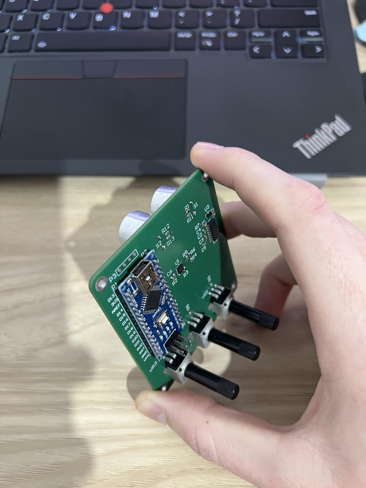
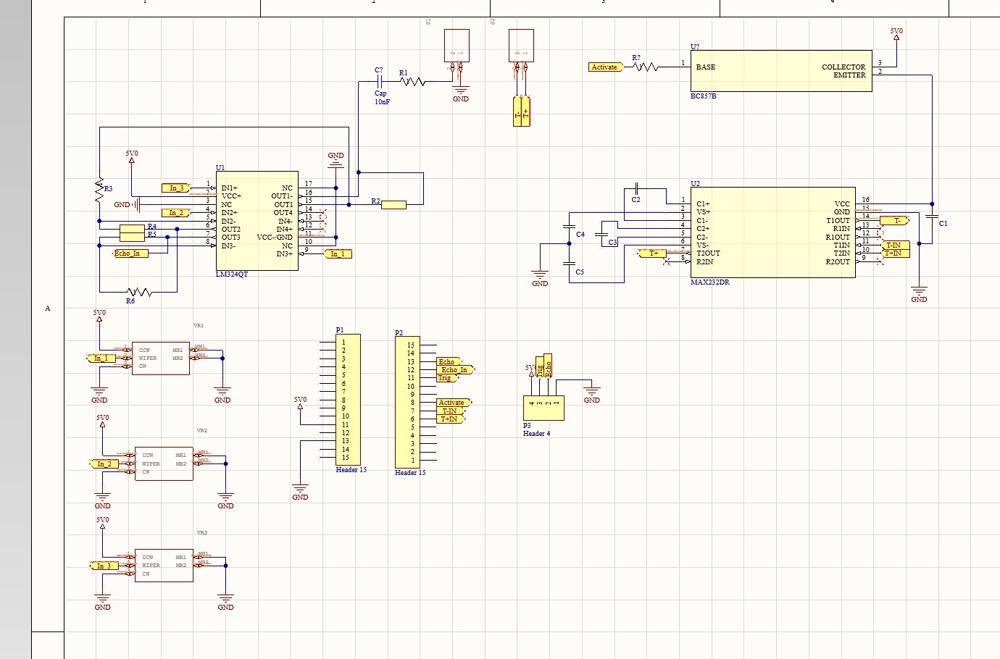

# Ultrasonic Defectoscope

An ultrasonic surface profiling system for real-time detection of surface defects (holes and bumps) using Arduino and Python-based HMI interface.

## Overview

This project implements a non-contact ultrasonic measurement system that can detect surface irregularities in real-time. The system uses an ultrasonic transducer to measure surface distances and alerts the operator when deviations exceed a configurable tolerance threshold.

### Key Features

- **Real-time surface profiling** with ultrasonic sensing
- **Defect detection** - Identifies holes (increased distance) and bumps (decreased distance)
- **Calibration system** - Set reference "zero" point for any surface
- **Visual feedback** - Color-coded GUI with status indicators
- **Live graphing** - Real-time visualization of surface profile
- **Adjustable sensitivity** - Configure tolerance threshold (default: ±5mm)

## Project Images

### Prototype


### Electrical Circuit


## Hardware Requirements

- Arduino board (e.g., Arduino Uno)
- Ultrasonic transducer (40kHz)
- MAX232 level shifter
- Serial connection (USB)

### Pin Configuration

| Pin | Function |
|-----|----------|
| D3, D4 | Ultrasonic burst generation (40kHz) |
| D5 | MAX232 power control |
| D8 | Trigger input (interrupt) |
| D9 | Echo input (interrupt) |
| D10 | Echo pulse output |

## Software Requirements

### Python Dependencies

```bash
pip install PyQt6 pyqtgraph pyserial
```

### Arduino IDE

- Version 1.8.x or later
- No additional libraries required (uses native interrupts)

## Installation

1. **Clone the repository**
   ```bash
   git clone https://github.com/yourusername/Ultrasonic-Defectoscope.git
   cd Ultrasonic-Defectoscope
   ```

2. **Upload Arduino firmware**
   - Open `Arduino_Prototype/Arduino_Prototype.ino` in Arduino IDE
   - Select your board and port
   - Upload to Arduino

3. **Configure serial port**
   - Edit `HMI_Interface.py`
   - Set `PORT_ARDUINO` to your Arduino's serial port (e.g., "COM3" on Windows, "/dev/ttyUSB0" on Linux)

4. **Run the HMI Interface**
   ```bash
   python HMI_Interface.py
   ```

## Usage

1. **Launch the application** - Run `HMI_Interface.py`

2. **Calibrate the sensor**
   - Position the sensor over a known good surface
   - Click the "CALIBRATE (ZERO)" button
   - The system will set this as the reference level

3. **Scan surfaces**
   - Move the sensor across the surface to inspect
   - The GUI will alert you to defects:
     - **Red background** - Hole detected (distance increased)
     - **Orange background** - Bump detected (distance decreased)
     - **Gray background** - Normal surface

4. **Monitor the graph**
   - Real-time surface profile visualization
   - Yellow dashed line indicates calibrated reference
   - Cyan line shows current measurements

## Configuration

### Sensitivity Settings

Edit `HMI_Interface.py` to adjust:

```python
TOLERANCE_MM = 5.0  # Detection threshold in millimeters
BUFFER_SIZE = 300   # Number of data points to display
BAUD_RATE = 115200  # Must match Arduino setting
```

### Arduino Settings

Edit `Arduino_Prototype.ino` to adjust:

```cpp
Serial.begin(115200);  // Baud rate (must match Python)
```

The 40kHz burst frequency is hardware-timed and should not be modified without proper calibration.

## Technical Details

### Measurement Principle

The system uses the time-of-flight principle:
- **Speed of sound**: 343 m/s (0.0343 cm/µs)
- **Distance calculation**: `Distance = (Time × Speed) / 2`
- **Resolution**: Sub-millimeter accuracy

### Arduino Implementation

- **Interrupt-driven** for precise timing
- **8-cycle 40kHz burst** for optimal transducer response
- **Hardware PWM** for accurate frequency generation
- **Non-blocking** measurement cycle

### Python HMI Features

- **PyQt6** for modern GUI
- **pyqtgraph** for real-time plotting
- **Threading** for non-blocking serial communication
- **Statistics** for noise reduction during calibration

## GUI Elements

- **Main Display**: Current distance reading in millimeters
- **Status Bar**: System state and defect alerts
- **Calibration Button**: Set reference surface level
- **Real-time Graph**: Scrolling surface profile display
- **Color Coding**: Visual defect indication

## Troubleshooting

### Cannot connect to Arduino
- Verify the correct COM port in `PORT_ARDUINO`
- Check if Arduino is properly connected via USB
- Ensure no other application is using the serial port

### Erratic readings
- Increase calibration buffer size
- Check ultrasonic transducer alignment
- Ensure stable power supply

### No graph updates
- Verify serial communication is working
- Check baud rate matches on both sides (115200)
- Restart the application

## Project Structure

```
Ultrasonic-Defectoscope/
├── HMI_Interface.py          # Python GUI application
├── Arduino_Prototype/
│   └── Arduino_Prototype.ino # Arduino firmware
├── Imgs/                     # Project images/screenshots
├── LICENSE
└── README.md
```

## Future Enhancements

- [ ] Data logging and export functionality
- [ ] Multi-sensor support for wider coverage
- [ ] 3D surface mapping
- [ ] Automatic defect classification
- [ ] Adjustable measurement frequency
- [ ] Mobile app interface

## License

This project is licensed under the terms specified in the LICENSE file.

## Contributing

Contributions are welcome! Please feel free to submit pull requests or open issues for bugs and feature requests.

## Safety Notes

- Ultrasonic transducers can generate high-frequency sound - avoid prolonged direct exposure
- Ensure proper electrical isolation when working with MAX232 circuits
- Use appropriate power supplies as specified

## Contact

For questions or support, please open an issue on the GitHub repository.

---

